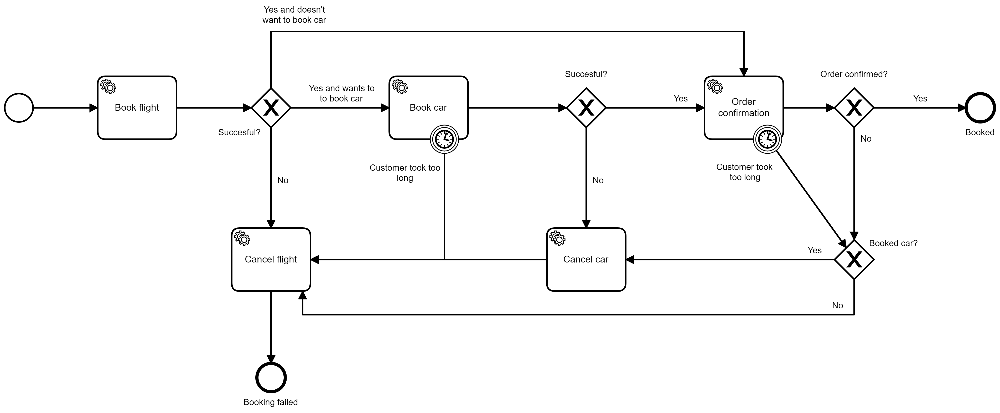

# SI Exam Monolithic Application

## Requirements ⚠

Visual Studio 2019  
Microsoft SQL Server 2019  
.NET 5.0  
Camunda BPM Tomcat 7.14.0  
Camunda Modeler 4.4.0

## Setup 🛠

1. Setup the following environment variables:
   | Key | Value |
   | :--| :-- |
   |SI_EXAM_SERVER| YOUR_SERVER_NAME: e.g. LAPTOP-DDB3EQTP|
   | SI_EXAM_DB_NAME | YOUR_DATABASE_NAME |
2. Import the data from [the SQL data file](./sql_data/si_exam_data.sql) into your SQL database.
3. Start your camunda server and deploy the model found [here.](./BPMN/booking.bpmn)

## BPMN 👨‍💼

We use BPMN and Camunda to automise cancellation of flights and cars. If the process is somehow interrupted, we have timers in Camunda that will make an external service call to cancel the flight booking, and car booking if one is made. Otherwise the user has the choice to cancel the booking at the end of the process if they change their mind.

